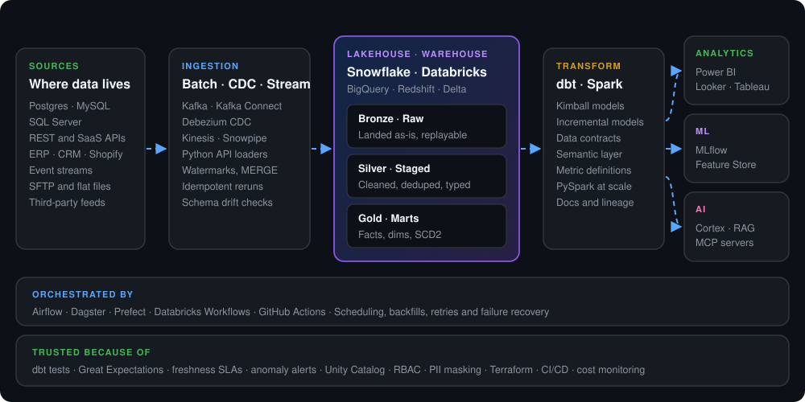

<!--
  Profile README for github.com/Logicalengineer109
  Publish: create a PUBLIC repo named exactly Logicalengineer109, then upload README.md,
  data-platform.svg and flow.svg (all three in the main folder).
  To add email or LinkedIn, paste these into the "Get in touch" block next to the GitHub badge:
  
  
-->

 

 

I build the data infrastructure that product and business decisions run on. My work starts at messy source systems (production databases, event streams, SaaS APIs and flat files) and ends at **data models that analysts, dashboards and ML systems can trust without double-checking**. Along the way I care about three things: **correctness, observability and cost**.

---

## 🎯 What I own

| Area | What it looks like in production |
|:--|:--|
| **Ingestion** | Python ETL/ELT from REST APIs (auth, pagination, rate limits), SaaS tools (Shopify, HubSpot, Salesforce, Stripe, Qualtrics), SFTP files and production databases |
| **Incremental loads** | Watermark and control tables, `MERGE` upserts, soft deletes, idempotent reruns, backfills and schema drift detection |
| **Streaming & CDC** | Kafka, Kafka Connect and Debezium feeding Spark Structured Streaming, Delta Lake and Snowpipe for near-real-time views |
| **Modeling** | Kimball star schemas, conformed dimensions, surrogate keys, SCD Type 2, One Big Table and medallion layers, with the grain agreed first |
| **Transformation** | dbt incremental models, snapshots, macros, exposures, docs, data contracts and the dbt Semantic Layer |
| **Orchestration** | Airflow, Dagster, Prefect, Databricks Workflows and GitHub Actions for scheduling, dependencies, backfills and failure recovery |
| **Quality & observability** | dbt tests, Great Expectations, freshness SLAs, anomaly alerts, lineage, runbooks and data dictionaries |
| **Cost & performance** | Partitioning, clustering, incremental models, query tuning, right-sized compute and cost per pipeline |
| **ML & AI readiness** | MLflow, Unity Catalog, Feature Store, Snowflake Cortex, semantic views, vector search and MCP servers over governed data |

---

## 🗺️ Platform blueprint

  

---

## 🧰 Stack by layer

| Layer | Tools |
|:--|:--|
| **Languages** |       |
| **Warehouse & lakehouse** |         |
| **Streaming & CDC** |        |
| **Transform & orchestrate** |          |
| **Modeling** |         |
| **Quality & governance** |        |
| **ML, AI & BI** |          |
| **Cloud & DevOps** | -0b1320?style=flat)        |
| **Databases** |      |
| **Daily tools** |       |

---

## 🔁 How I work

  

## 📐 Principles I build by

1. **Agree on the grain before writing SQL.** Most broken dashboards trace back to a fact table nobody defined.
2. **Every load can run twice.** Pipelines are incremental and idempotent, so a rerun or backfill never creates duplicates.
3. **Tests ship with the model.** Schema tests, contracts and freshness checks live in the same PR as the code.
4. **If it isn't monitored, it isn't done.** Every pipeline has an owner, an alert and a runbook.
5. **Cost is a feature.** Partitioning, incremental models and right-sized compute are part of the design, not a cleanup task.
6. **AI assistants speed me up, not sign off for me.** I use them for drafting, review and debugging, and I own every line that ships.

---

<!--
  Uncomment this section once these repos exist and are public, then check the links.

## 📂 Featured projects

| Project | What it shows | Stack |
|:--|:--|:--|
| [snowflake-saas-elt-framework](https://github.com/Logicalengineer109/snowflake-saas-elt-framework) | Config-driven API ingestion, MERGE upserts, watermarks, SCD2 star schema | Python · Snowflake · dbt · GitHub Actions · AWS |
| [realtime-cdc-medallion-lakehouse](https://github.com/Logicalengineer109/realtime-cdc-medallion-lakehouse) | Postgres CDC to a bronze, silver and gold lakehouse in near real time | Debezium · Kafka · Spark Streaming · Delta · Airflow |
| [governed-llm-retrieval-mcp](https://github.com/Logicalengineer109/governed-llm-retrieval-mcp) | MCP server over governed tables with masking enforced at query time | Databricks · Unity Catalog · pgvector · MCP |
| [lakehouse-cost-observability](https://github.com/Logicalengineer109/lakehouse-cost-observability) | Cost per pipeline and freshness SLA models with alerts | dbt · Snowflake · Streamlit · Grafana |
| [databricks-campaign-forecasting-lift](https://github.com/Logicalengineer109/databricks-campaign-forecasting-lift) | Campaign forecasting and incrementality testing as an MLOps pipeline | PySpark · MLflow · Unity Catalog · Asset Bundles |

---
-->

## 📬 Get in touch

Need a data platform built, pipelines nobody trusts fixed, or your data made ready for BI and AI? Let's talk.

 

