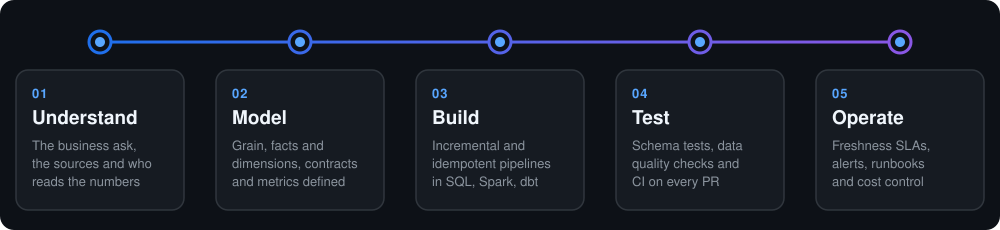

<!--
  Profile README for github.com/Arslanabbas102
  Publish: create a public repo named Arslanabbas102, then upload README.md, flow.svg
  and ai-architecture.svg (all three in the main folder).
  To add LinkedIn, put this line above the Email button in "Let's connect":
  
-->

 

---

### About me

I'm a **Senior Full Stack AI Engineer** with **8+ years** of experience building web products, and the last several years building **LLM-powered products, RAG systems and AI agents**, for startups and growing businesses in **SaaS · FinTech · E-commerce · Healthcare · EdTech · Logistics · Marketplaces**.

I work with **founders and product teams** to take an idea to a launched product, from the first prototype to a platform that handles real users. That covers the frontend, the backend and APIs, the AI layer (agents, RAG, LLM integrations) and the cloud it runs on.

- 🚀 Building **AI-powered products and MVPs** end to end
- 🤖 Focused on **LLM apps, RAG pipelines and AI agents** that hold up in production
- 🧠 Working with **OpenAI, Claude, Gemini and open-source models** (Llama, Mistral)
- 💬 Ask me about **RAG, AI agents, LLM integrations, React, Next.js, Node.js and Python**
- 📬 **arslanabbasdev@gmail.com**

---

### 🧠 What I build with AI

- **LLM-powered apps:** AI assistants, copilots and chat interfaces with streaming responses, built on OpenAI, Claude, Gemini and open-source models
- **RAG systems:** document ingestion, chunking, embeddings, hybrid search and reranking, so answers come from your own data with sources cited
- **AI agents:** multi-step agents that call tools and APIs, built with LangGraph and LangChain, with MCP servers and human review where it matters
- **Document AI:** pipelines that turn PDFs, contracts and invoices into structured, searchable data
- **Workflow automation:** AI steps added to real business processes (support, sales, operations) with n8n and custom backends
- **Production readiness:** evaluations, guardrails, prompt versioning, tracing, and keeping cost and latency under control

---

### 🏗️ How I build AI products

  

---

### ⚡ How I work

  

---

### Frontend

---

### Backend

---

### LLMs & Models

---

### AI Agents & Frameworks

---

### RAG & Vector Search

---

### ML & Data

---

### Cloud & DevOps

---

### 🛠️ Tools

---

### Industries I've worked in

`SaaS` &nbsp; `FinTech` &nbsp; `E-commerce` &nbsp; `Healthcare` &nbsp; `EdTech` &nbsp; `Logistics` &nbsp; `Marketplaces`

---

### Let's connect

Planning an MVP, adding an LLM, RAG or agent feature to your product, or just want to talk tech? I'm happy to hear from you.

 

